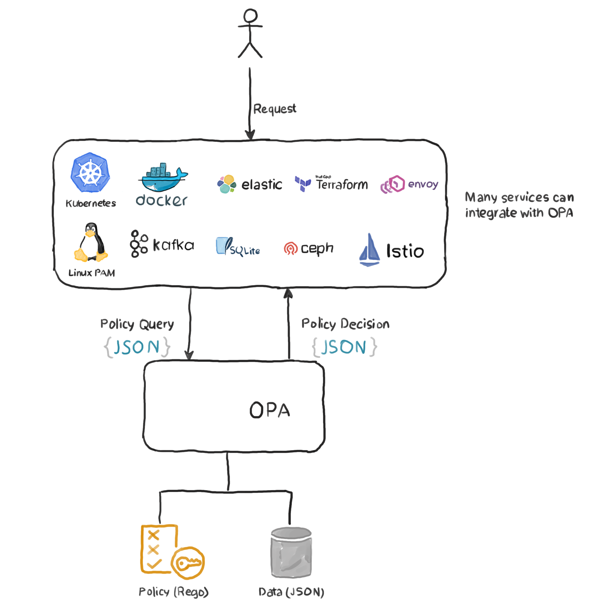
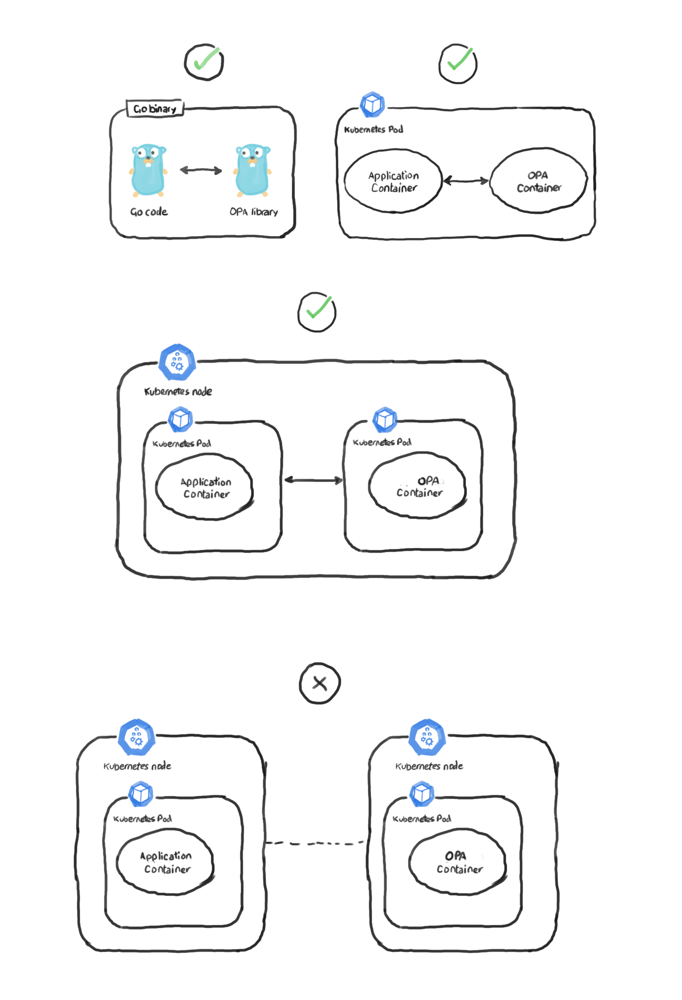

# Distribute your policies with the power of OpenFaaS

Let's clarify what is the motivation behind this post first.

One of the feature OpenFaaS is [auto-scaling](https://docs.openfaas.com/architecture/autoscaling/) mechanism. The auto-scaling means is that you can scale up/down your function instances as demand increases. Also OpenFaaS provides 
a feature called [zero-scale](https://docs.openfaas.com/architecture/autoscaling/#zero-scale). By enabling this feature , you can scaling to zero to recover idle resources is available in OpenFaaS.

Using OpenFaaS as an OPA's Bundle API , you can have all the features by default with less effort.Also, you can't have to manage build/push and deploy phases with your Bundle API's .

### What you will learn in this post ?

In this post we are gonna learn:

* [What is OPA (Open Policy Agent) ?](#whatisopa)
* How can we deploy OPA co-located with our service ?
* What is Rego ? (with a sample)
* How can we create a OpenFaaS function and set it up as a Bundle API?
* Demo

### <a id="whatisopa"></a> What is OPA (Open Policy Agent) ?

OPA describes itself as a general purpose policy engine, for more detail you can look at the official [documentation](https://www.openpolicyagent.org/docs/latest/).

OPA's main goal is decoupling the policy decision-making from the policy enforcement. When your software needs to make policy decisions it queries OPA and supplies structured data (e.g., JSON) as input. OPA accepts arbitrary structured data as input.


> Credit: https://www.magalix.com/blog/introducing-policy-as-code-the-open-policy-agent-opa

When it comes to deploying OPA, you have more than one option depending on your specific scenario:

* As a Go library
* As a daemon

The recommended way is to run OPA is as a daemon. The reason is that this design increases performance and availability.By default, all of the policy and data that OPA uses to make decisions is kept in-memory for the low-latency and we should colocate OPA and the service to avoid the network latency also.


> Credit: https://www.magalix.com/blog/introducing-policy-as-code-the-open-policy-agent-opa

## How can OpenFaaS help us about the OPA ?

OPA exposes a set of APIs that enable unified, logically centralized policy management which is called ["Management API's"](https://www.openpolicyagent.org/docs/latest/management/). Think of them as a `Control Plane` for the OPA instances working as a `Data Plane. With the Management API's you can control the OPA instances like enable decision logging, configure the Bundle API etc.

Let's focus on Bundle API which is one of the Management API's for OPA.

Bundle API's purpose is to help OPA to load policies across the stack to the OPA instances.OPA can periodically download bundles of policy and data from remote HTTP servers. The policies and data are loaded on the fly without requiring a restart of OPA.

In this demo, we create a serverless function that mimics an OPA's Bundle API.Simply, this serverless function designed as a plain file server. When OPA's asks for the policies it basically returns bundles that ready on the filesystem as a response.

### Demo

 Prerequisites
* A Kubernetes cluster (kind, minikube, etc.)
* OpenFaaS CLI
* Arkade
* Kubectl
* KinD
* Skopo

## 2. Setup Tools
* Arkade
```sh
$ curl -sLS https://dl.get-arkade.dev | sudo sh
```

* KinD
```sh
$ arkade get kind
```

* Kubectl
```sh
$ arkade get kubectl
```

* OpenFaaS CLI
```sh
$ arkade get faas-cli
```

* Skopeo
```sh
$ brew install skopeo
```

# Setup

### 1. Set Up Cluster

With Kind, you can run a local Kubernetes cluster using Docker containers as nodes. The steps in this section are optional. Follow them only if you don't have a running Kubernetes cluster.

* This [generate_kind_local_registry](hack/generate_kind_local_registry.sh)script  will create a kind cluster with the local registry.

```sh
$ sh generate_kind_local_registry.sh
```

### 2. Deploy OpenFaaS

* Install OpenFaaS using Arkade

```sh
$ arkade install openfaas
```

* Verify Deployment

```sh
$ kubectl rollout status -n openfaas deploy/gateway
```

* Enable local access to Gateway
```sh
$ kubectl port-forward -n openfaas svc/gateway 8080:8080 &
```

### 3. Configure faas-cli

* Access password that available in the basic-auth secret in openfaas namespace

```sh
$ PASSWORD=$(kubectl get secret -n openfaas basic-auth -o jsonpath="{.data.basic-auth-password}" | base64 --decode; echo)
```

* Login with using the password to Gateway

```sh
$ echo -n $PASSWORD | faas-cli login --username admin --password-stdin
```

### 3. Deploy Function

* Go the functions directory , pull the right template and deploy the function

```sh
$ cd functions
$ faas-cli template store pull golang-middleware
$ faas-cli up -f bundle-api.yml
```

### 4. Copy Images

* Copy images from Docker Hub to local registry

```sh
$ skopeo copy --dest-tls-verify=false docker://openpolicyagent/opa:latest docker://localhost:5000/opa:latest <br>
$ skopeo copy --dest-tls-verify=false docker://openpolicyagent/demo-restful-api:0.2 docker://localhost:5000/demo-restful-api:0.2
```

### 5. Deploy application

* Deploy application with located OPA, detail: [deployment.yaml](hack/manifests/deployment.yaml)

```sh
$ cd ../hack/manifests <br>
$ kubectl apply -f deployment.yaml
```

* Verify Deployment

```sh
$ kubectl rollout status deployment demo-restful-api
```

* Enable local access to application

```sh
$ kubectl port-forward svc/demo-restful-api 5000:80 &
```

### Test

[Rego](https://www.openpolicyagent.org/docs/latest/#rego) is the DSL for the OPA. We can author our policies using rego.

For this tutorial, our desired policy is:

* People can see their own salaries (GET /finance/salary/{user} is permitted for {user})
* A manager can see their direct reports’ salaries (GET /finance/salary/{user} is permitted for {user}’s manager)


### Check that alice can see her own salary

* This command will succeed, because alice wants to see your own salary.

```sh
$ curl --user alice:password localhost:5000/finance/salary/alice
```

### Check that bob CANNOT see charlie’s salary.

* bob is not charlie’s manager, so the following command will fail.

```sh
$ curl --user bob:password localhost:5000/finance/salary/charlie
```